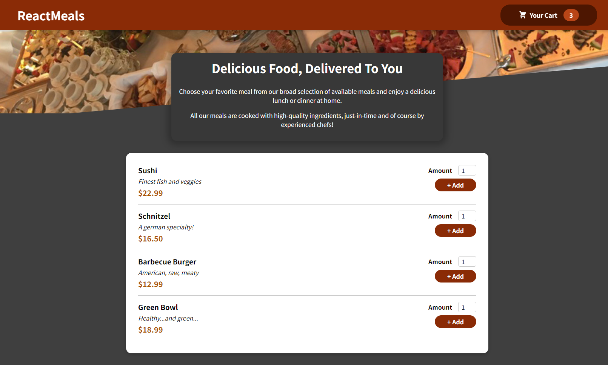

  

<h2>About the project</h2>

A website showcasing <b>ReactMeals</b>. An application to add foods to your cart and order. This was used as a way to practice React component fundamentals such as contexts, states, and components.

▶ Live Demo: <a href="https://react-meals-tawny.vercel.app/">ReactMeals</a>

<h3>Built with:</h3>
⚛ React JS

<h2>Screenshot of the Project 📸</h2>
 

  

